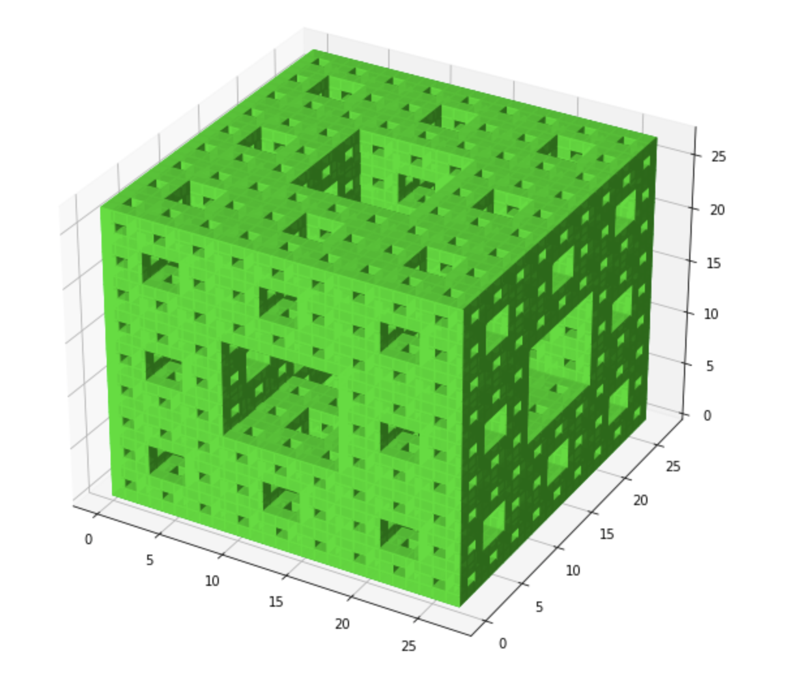

# SomeFractals 🎯

Just a university exercise ^^

## Menger Sponge

* [Wiki](https://en.wikipedia.org/wiki/Menger_sponge)
* [Binder online](https://mybinder.org/v2/gh/abionics/SomeFractals/HEAD?labpath=menger_sponge%2Fmenger_sponge.ipynb)
* [Jupyter](menger_sponge/menger_sponge.ipynb) and [Python](menger_sponge/menger_sponge.py) codes
